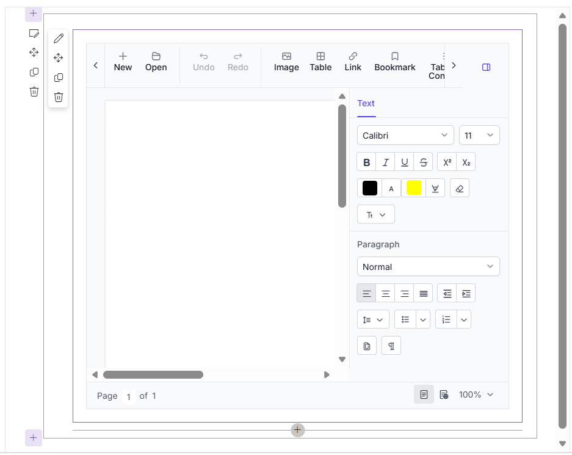

# documenteditor-spfx-react

## Overview

This sample demonstrates how to integrate the Syncfusion React Document Editor component into a SharePoint Framework (SPFx) React web part.

## Prerequisites

- Node.js 22.x
- Microsoft 365 SharePoint Online tenant
- SharePoint Framework (SPFx) 1.23.2

## Getting Started

### Clone the Repository

```cmd
git clone <repository-url>
cd documenteditor-spfx-react
```

### Install Dependencies

```cmd
npm install
```

### Trust Development Certificate

```cmd
npx heft trust-dev-cert
```

### Build the Project

```cmd
npm run build
```

### Run the Project

```cmd
npm run start
```

## Configure SharePoint Workbench

Update the `config/serve.json` file with your SharePoint site URL:

```json
{
  "$schema": "https://developer.microsoft.com/json-schemas/spfx-build/spfx-serve.schema.json",
  "port": 4321,
  "https": true,
  "initialPage": "https://<tenant>.sharepoint.com/sites/<site>/_layouts/workbench.aspx"
}
```

Example:

```json
{
  "$schema": "https://developer.microsoft.com/json-schemas/spfx-build/spfx-serve.schema.json",
  "port": 4321,
  "https": true,
  "initialPage": "https://contoso.sharepoint.com/sites/dev/_layouts/workbench.aspx"
}
```

## Sample Features

This sample demonstrates:

- Integration of Syncfusion React Document Editor in a SharePoint Framework React web part.
- Loading Syncfusion themes in SharePoint using `SPComponentLoader`.
- Running the Document Editor inside SharePoint Workbench.
- Rich document editing experience with the built-in toolbar.

## Theme Configuration

This sample uses `SPComponentLoader` to load the Syncfusion Tailwind theme in SharePoint Framework applications.

## Output

The following screenshot shows the Syncfusion React Document Editor running inside a SharePoint Framework (SPFx) web part.



## Documentation

For detailed integration steps, refer to the [Syncfusion Document Editor documentation](https://help.syncfusion.com/document-processing/word/word-processor/react/environment-integration/sharepoint?utm_source=github&utm_medium=listing&utm_campaign=github-react-docx-editor-examples).

## License

This is a commercial product and requires a paid license for possession or use. Syncfusion's licensed software, including this component, is subject to the terms and conditions of [Syncfusion's EULA](https://www.syncfusion.com/license/studio/22.2.5/syncfusion_essential_studio_eula.pdf?utm_source=github&utm_medium=listing&utm_campaign=github-react-docx-editor-examples). You can purchase a license [here](https://www.syncfusion.com/sales/products?utm_source=github&utm_medium=listing&utm_campaign=github-react-docx-editor-examples) or start a free 30\-day trial [here](https://www.syncfusion.com/account/manage-trials/start-trials?utm_source=github&utm_medium=listing&utm_campaign=github-react-docx-editor-examples).

# Support and feedback

For any other queries, reach our [Syncfusion® support team](https://support.syncfusion.com/?utm_source=github&utm_medium=listing&utm_campaign=github-react-docx-editor-examples) or post the queries through the [community forums](https://www.syncfusion.com/forums?utm_source=github&utm_medium=listing&utm_campaign=github-react-docx-editor-examples). 

Request new feature through [Syncfusion® feedback portal](https://www.syncfusion.com/feedback?utm_source=github&utm_medium=listing&utm_campaign=github-react-docx-editor-examples). 